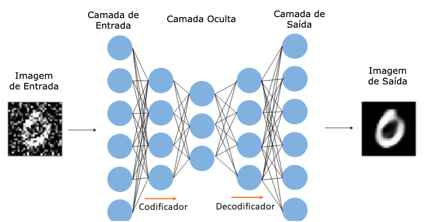

# Autoencoder to RGB images

Os autoencoders são uma técnica de aprendizado não supervisionado, na qual usamos as redes neurais para a tarefa de aprendizado de representação. A idéia principal é projetar uma arquitetura de rede neural de modo a impor um gargalo na rede que força uma representação de conhecimento compactada da entrada original.

Esse tipo de rede é composto de duas partes:

**Codificador (Encoder)**: é a parte da rede que compacta a entrada em uma representação de espaço latente (codificando a entrada). Pode ser representado por uma função de codificação h = f(x).

**Decodificador (Decoder)**: Esta parte tem como objetivo reconstruir a entrada da representação do espaço latente. Pode ser representado por uma função de decodificação r = g(h).

Os autocodificadores fornecem um dos paradigmas fundamentais para a aprendizagem não supervisionada, e abordam como as mudanças sinápticas induzidas por eventos locais podem ser coordenadas de maneira auto-organizada para produzir aprendizado global e comportamento inteligente [[Baldi, 2012]](http://proceedings.mlr.press/v27/baldi12a/baldi12a.pdf).
